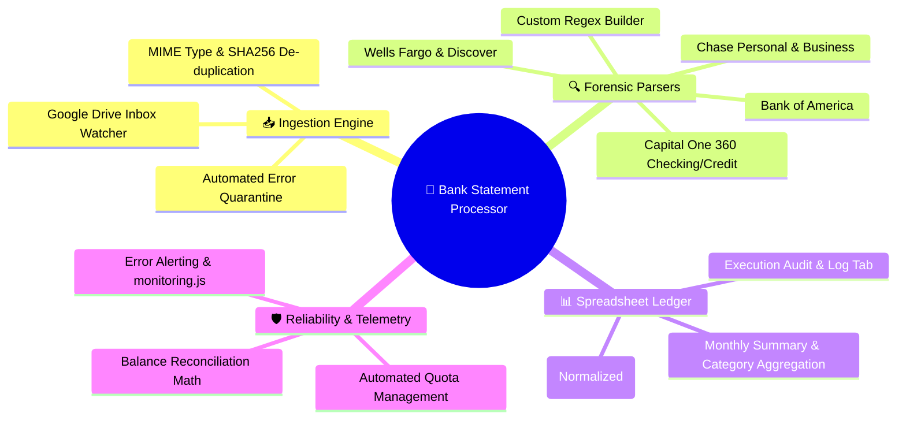
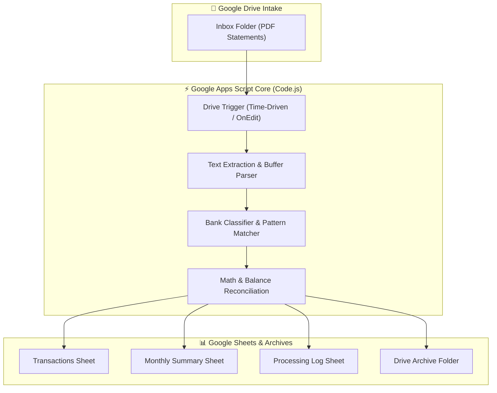

<!-- 🏦 BANK STATEMENT PROCESSOR — REPOSITORY PRESENTATION (L3 SHOWCASE) -->

<div align="center">


# **🏦 Bank Statement Processor**

**An enterprise-grade Google Apps Script & Python automation pipeline for high-precision PDF bank statement parsing, financial ledger ingestion, and automated spreadsheet reconciliation.**

[](#-project-information)
[](appsscript.json)
[](.clasp.json)
[](python/)
[](LICENSE)
[](https://github.com/traikdude/Bank_Statement_Processor)

<p align="center">
  <a href="#-overview"><b>Overview</b></a> •
  <a href="#-core-features"><b>Features</b></a> •
  <a href="#-supported-institutions"><b>Institutions</b></a> •
  <a href="#-data-pipeline--architecture"><b>Pipeline</b></a> •
  <a href="#-configuration--setup"><b>Setup</b></a> •
  <a href="#-contributing"><b>Contributing</b></a> •
  <a href="#-license"><b>License</b></a>
</p>

</div>

---

## 📑 Table of Contents

- [✨ Overview](#-overview)
- [🚀 Core Features](#-core-features)
  - [1. Multi-Bank PDF Ingestion Pipeline](#1-multi-bank-pdf-ingestion-pipeline)
  - [2. Deterministic Regex & OCR Extraction](#2-deterministic-regex--ocr-extraction)
  - [3. Automated Google Sheets Reconciliation](#3-automated-google-sheets-reconciliation)
  - [4. File Lifecycle & Archive Automation](#4-file-lifecycle--archive-automation)
  - [5. System Health Monitoring & Telemetry](#5-system-health-monitoring--telemetry)
- [🏦 Supported Financial Institutions](#-supported-financial-institutions)
- [🏗️ Data Pipeline & Architecture](#-data-pipeline--architecture)
- [⚙️ Configuration & Setup](#-configuration--setup)
  - [Clasp Deployment](#clasp-deployment)
  - [Google Drive Folder Schema](#google-drive-folder-schema)
- [🗂️ Repository Structure](#-repository-structure)
- [🤝 Contributing](#-contributing)
- [📄 License](#-license)

---

## ✨ Overview

**Bank Statement Processor** is a production-grade financial automation engine built with **Google Apps Script (V8)** and auxiliary **Python** extraction scripts.

The system automatically monitors an incoming Google Drive inbox folder for raw bank statement PDFs, extracts transaction dates, merchant descriptions, credit/debit amounts, and running balances with regex precision, verifies closing balance integrity against opening figures, and populates categorized records directly into a master Google Sheet.

---

## 🚀 Core Features



### 1. Multi-Bank PDF Ingestion Pipeline
Monitors designated Google Drive folders, reads statement files via Apps Script `DriveApp`, and prevents redundant processing using checksum validation.

### 2. Deterministic Regex & OCR Extraction
Custom regex rulesets extract line items, transaction dates, categorization tags, and balance milestones without hallucination.

### 3. Automated Google Sheets Reconciliation
Appends cleaned transactions into formatted spreadsheet ledgers, updating running balances and generating monthly category summaries automatically.

### 4. File Lifecycle & Archive Automation
Moves completed PDFs into `Processed` or `Archive` folders upon successful ledger write, quarantining malformed documents to `Error/Quarantine` with diagnostic notes.

### 5. System Health Monitoring & Telemetry
Monitors Apps Script quota consumption, execution timeouts, and daily trigger reliability via [`monitoring.js`](monitoring.js).

---

## 🏦 Supported Financial Institutions

| Institution | Supported Account Types | Parser Strategy |
|---|---|---|
| 💳 **Capital One** | 360 Checking, Venture/Quicksilver Credit | Date regex + debit/credit token alignment |
| 🏦 **Chase** | Total Checking, Sapphire/Ink Business | Tabular column bounds & transaction codes |
| 🏛️ **Bank of America** | Advantage Checking, Customized Cash | Multi-line description reconciliation |
| 🌐 **Wells Fargo** | Everyday Checking, Way2Save | Clean transaction demarcation |
| 🔍 **Generic / Fallback** | Universal CSV / Text Statements | Flexible fuzzy date/amount matchers |

---

## 🏗️ Data Pipeline & Architecture



---

## ⚙️ Configuration & Setup

### Clasp Deployment

```bash
# Clone the repository
git clone https://github.com/traikdude/Bank_Statement_Processor.git
cd Bank_Statement_Processor

# Authenticate with Google Apps Script Clasp CLI
clasp login

# Pull or push changes
clasp pull
clasp push
```

### Google Drive Folder Schema
Set the corresponding Folder IDs inside `Code.js`:
* `CONFIG.FOLDERS.INPUT_PDF_FOLDER_ID`: Raw statement deposit folder.
* `CONFIG.FOLDERS.PROCESSED_FOLDER_ID`: Successfully processed statements.
* `CONFIG.FOLDERS.ARCHIVE_FOLDER_ID`: Long-term quarterly/yearly storage.

---

## 🗂️ Repository Structure

```text
Bank_Statement_Processor/
├── docs/                        # Presentation & visual assets
│   └── assets/
│       └── banner.png           # L3 Showcase high-resolution hero banner
├── python/                      # Python auxiliary PDF extraction & pandas tools
├── .github/workflows/           # Automated CI/CD deployment pipelines
├── Code.js                      # 85KB+ Core Apps Script parser & ledger engine
├── monitoring.js                # Execution health, trigger logs & telemetry
├── appsscript.json              # Apps Script manifest, V8 runtime & scopes
├── .clasp.json                  # Google Apps Script project binding
├── README.md                    # L3 Showcase presentation documentation
└── LICENSE                      # MIT Open Source License
```

---

## 🤝 Contributing

1. Fork the repository and create your feature branch (`git checkout -b feature/new-bank-parser`).
2. Add new bank regex definitions or validation checks in `Code.js`.
3. Push changes with `clasp push` and test in your sandbox sheet.
4. Submit a Pull Request.

---

## 📄 License

Distributed under the **MIT License**. See [LICENSE](LICENSE) for details.

---

<div align="center">

*Engineered for Financial Automation, Ledger Integrity & Sovereign Agents.*  
**Bank Statement Processor · Google Apps Script · Python · Google Workspace**

</div>
